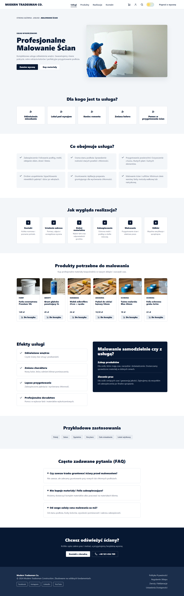
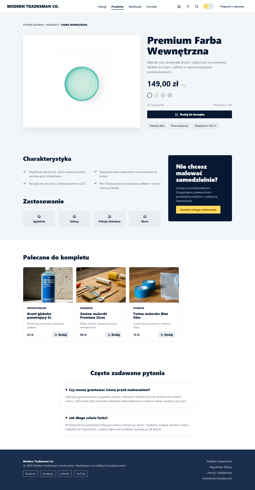
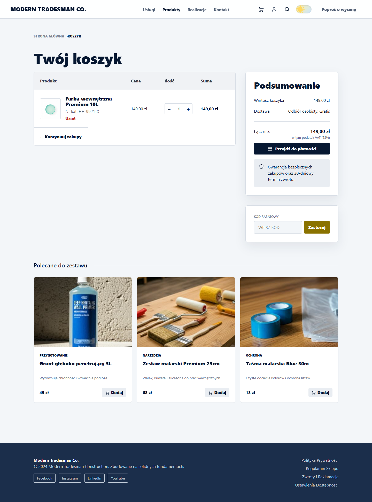
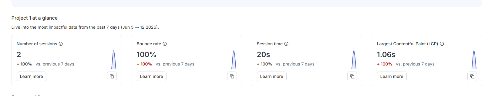

# Modern Tradesman Co.

Projekt frontendowy sklepu budowlanego i serwisu remontowego przygotowany w React + Vite. Aplikacja odwzorowuje ekran glowny, usluge malowania, produkt, koszyk, checkout, potwierdzenie zamowienia, kontakt oraz widoki konta klienta.

Glowna aplikacja znajduje sie w katalogu `hardware-shop`.

## Struktura

```text
TPF/
  hardware-shop/                 React + Vite frontend application
    docs/screenshots/            screeny aplikacji do dokumentacji
    src/components/              komponenty wspolne
    src/pages/                   widoki podlaczone do React Routera
    src/utils/analytics.js       konfiguracja Google Analytics i Hotjar
  reference/                     PDF-y referencyjne z makietami
  readme.md                      dokumentacja projektu
```

## Funkcje

- Strona glowna z sekcjami uslug, produktow, realizacji, porad i CTA.
- Osobne widoki dla uslugi, produktu, koszyka, checkoutu, potwierdzenia, kontaktu, logowania, rejestracji i konta.
- Routing przez React Router, lacznie z fallbackiem 404.
- Komponenty wspolne dla layoutu, kart, ikon, przyciskow i elementow formularzy.
- Responsywny layout oraz tryb jasny/ciemny zapisywany w `localStorage`.
- Integracja Google Analytics 4 przez `react-ga4`.
- Integracja Hotjar przez `@hotjar/browser`.
- Listener zmian tras SPA wysylajacy pageview do GA4 i `stateChange` do Hotjar.

## Technologie

- React 19
- React Router
- Vite 8
- CSS custom properties
- Google Analytics 4 (`gtag.js`)
- Hotjar (`@hotjar/browser`)
- ESLint

## Uruchomienie

Przejdz do katalogu aplikacji:

```bash
cd hardware-shop
```

Zainstaluj zaleznosci:

```bash
npm install
```

Uruchom serwer deweloperski:

```bash
npm run dev
```

Jesli PowerShell blokuje `npm.ps1`, uzyj:

```bash
npm.cmd run dev
```

Nastepnie otworz adres wypisany przez Vite, zwykle:

```text
http://127.0.0.1:5173/
```

## Komendy

```bash
npm run dev
npm run build
npm run lint
npm run preview
```

## Routing

Aplikacja ma nastepujace trasy:

```text
/
/service
/product
/cart
/checkout
/confirmation
/contact
/login
/register
/account
/*
```

Nieistniejace sciezki renderuja widok 404.

## Google Analytics i Hotjar

Integracje z Google Analytics 4 i Hotjar sa skonfigurowane przez zmienne srodowiskowe Vite. Konfiguracja lokalna znajduje sie w pliku `hardware-shop/.env.local`:

```env
VITE_GA_MEASUREMENT_ID=G-XXXXXXXXXX
VITE_HOTJAR_SITE_ID=123456
VITE_HOTJAR_VERSION=6
VITE_CONTENTSQUARE_TAG_URL=https://t.contentsquare.net/uxa/2d1deeef69c9c.js
VITE_ANALYTICS_DEBUG=false
```

Implementacja znajduje sie w:

- `hardware-shop/index.html` - reczny tag Google `gtag.js` oraz tag Contentsquare wymagany przez panel Hotjar.
- `hardware-shop/src/utils/analytics.js` - inicjalizacja GA4, Hotjar i wysylanie pageview dla tras SPA.
- `hardware-shop/src/components/AnalyticsListener.jsx` - wysylanie pageview przy zmianie trasy.
- `hardware-shop/src/App.jsx` - listener podlaczony wewnatrz `BrowserRouter`.

Przejscia miedzy trasami React Router sa raportowane jako pageview w GA4 oraz jako zmiany stanu strony w Hotjar. W kodzie zostaly dodane domyslne identyfikatory projektu, dlatego build zawiera konfiguracje analityki takze wtedy, gdy hosting nie przekaze zmiennych srodowiskowych do procesu budowania.

## Screeny aplikacji

Screeny zostaly zapisane w `hardware-shop/docs/screenshots`.

### Strona glowna


### Usluga



### Produkt



### Koszyk



### Checkout


### Kontakt


### Logowanie


### Konto


## Screeny Google Analytics i Hotjar

Screeny paneli analitycznych dokumentuja dzialajaca integracje Google Analytics 4 i Hotjar.

### Google Analytics - Realtime


### Google Analytics - Page views


### Hotjar - Dashboard



### Hotjar - Recording


